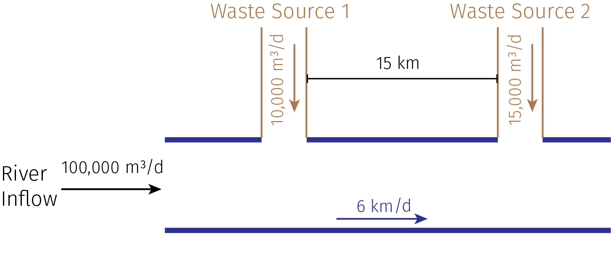

::: {.content-visible when-format="ipynb"}
**Name**:

**ID**:
:::

::: {.callout-important icon=false}
### Due Date

Thursday, 09/25/25, 9:00pm
:::

::: {.content-visible when-format="html"}

:::{.callout-caution}

If you are enrolled in the course, make sure that you use the GitHub Classroom link provided in Ed Discussion, or you may not be able to get help if you run into problems.

Otherwise, you can [find the Github repository here](/hw02).

:::

:::

## Overview

### Instructions

* Problem 1 asks you to draw a systems diagram and identify the type of a feedback.
* Problem 2 asks you to model contaminant concentrations in a river and use simulation to compare the concentrations to a regulatory standard.
* Problem 3 asks you to explore the implications of an ice-albedo feedback in the Earth's climate system by understanding the equilibria of the modeled system and their stabilities.

### Load Environment

The following code loads the environment and makes sure all needed packages are installed. This should be at the start of most Julia scripts.

```{julia}
#| output: false
import Pkg
Pkg.activate(@__DIR__)
Pkg.instantiate()
```

```{julia}
using Plots
using LaTeXStrings
using CSV
using DataFrames
using Roots
```

## Problems (Total: 30 Points)

::: {.markdown .cell}
### Problem 1 (5 points)

Draw a systems diagram for the relationship between global mean temperature, atmospheric CO~2~ concentrations, and ocean CO~2~ concentrations. What are the signs of the interactions between these components and why? What does this suggest about the overall feedback between temperature and the ocean carbon cycle?

:::

::: {.callout-tip}
Think about Henry's law for CO~2~.
:::

### Problem 2 (15 points)

A river which flows at 10 km/d is receiving discharges of wastewater contaminated with CRUD from two sources which are 15 km apart, as shown in the Figure below.  CRUD decays exponentially in the river at a rate of 0.36 $\mathrm{d}^{-1}$ and is deposited by the atmosphere along the river at a rate of 54 kg/km/d. 



::: {.markdown .cell}
#### Problem 2.1

Draw a systems diagram with the relevant control volume(s) denoted and any relevant in/out-flows between these boxes. How did you decide how many boxes were needed?

:::

::: {.markdown .cell}
#### Problem 2.2

Develop a model for the concentration of CRUD downriver by formulating and solving the appropriate differential equation(s) analytically.

:::

::: {.callout-tip}
Formulate your model in terms of distance downriver, rather than leaving it in terms of time from discharge.
:::

::: {.markdown .cell}
#### Problem 2.3

Determine if the system in compliance with a regulatory limit of $2.3\ \text{kg}/(1000 \text{m}^3)$. You can do this analytically or computationally.
:::

### Problem 3 (10 points)

In class, we discussed the ice-albedo feedback and its possible influence on melting the hypothesized ["Snowball Earth"](https://en.wikipedia.org/wiki/Snowball_Earth). In this problem, we'll introduce a simple model of the Earth's energy balance with includes this feedback and examine the stability of the climate.

This simple model of the energy balance (averaged over the entire planet) is:

$$
\underbrace{C\frac{dT}{dt}}_{\text{change in heat}} = \underbrace{\frac{(1-\alpha)S}{4}}_{\text{incoming radiation}} - \underbrace{(A - BT)}_{\text{outgoing radiation}} + \underbrace{a\ln \left(\frac{[CO_2]}{[CO_2]_{PI}}\right)}_{\text{greenhouse effect}},
$$ {#eq-climate}

where:

- $T$ is the Earth's global mean temperature (in $^\circ\text{C}$);
- $C$ is the heat capacity of the atmosphere and shallow ocean, taken to be $51\ \text{J}/\text{m}^2/^\circ\text{C}$;
- $\alpha$ is the planetary albedo, or the fraction of incoming radiation reflected by the Earth, which has a present-day value of approximately 0.3;
- $S$ is the solar constant, or the amount of solar radiation received by the Earth averaged over area, which has a present-day value of $1368\ \text{W}/\text{m}^2$ but during the Neoproteorozoic Era had a value of $1272\ \text{W}/\text{m}^2$ (this is divided by four because the Earth is a sphere but $S$ is the radiation captured by a disc with radius equal to that of the Earth);
- $A$ and $B$ are coefficients from the linearization of outgoing radiation physics, and have corresponding values $B=-1.3\ \text{W}/\text{m}^2/^\circ\text{C}$ (estimated from a number of lines of evidence about the sensitivity of outgoing radiation to temperature; this is negative due to a sign convention about the direction of incoming vs. outgoing radiation) and $A=221.2\ \text{W}/\text{m}^2$ (estimated by assuming  the pre-industrial temperature of $14^\circ\text{C}$ was stable without anthropogenic greenhouse gas emissions).

We will ignore the greenhouse effect term as we are considering the Earth system well before humans were around. 

::: {.markdown .cell}
#### Problem 3.1

Discretize the climate model (@eq-climate) using forward Euler integration and a time step of $\Delta t = 1$ yr.
:::

::: {.markdown .cell}
#### Problem 3.2

Rather than assuming a constant value for the albedo $\alpha$, we will represent the ice-albedo feedback by letting $\alpha$ depend on $T$:

$$\alpha(T) = 
    \begin{cases} 
        \alpha_i & \quad \text{if } T \leq -10^\circ \text{C} \\
        \alpha_i + (\alpha_0 - \alpha_i)((T+10) / 20) & \quad \text{if } -10^\circ \text{C} \leq T \leq 10^\circ \text{C} \\
        \alpha_0 & \quad \text{if } T \geq 10^\circ \text{C}.
    \end{cases}$$

Let $\alpha_i = 0.5$ and $\alpha_0 = 0.3$. Simulate the simple climate model using the Neoprotereozoic value of $S$ with temperature-varying albedo for initial values of $T$ spanning $-60^\circ\text{C} \leq T_0 \leq 30^\circ\text{C}$ over a period of 200 years. Plot the temperature trajectories. How many equilibria are there and what are their stabilities?
:::

::: {.markdown .cell}
#### Problem 3.3

One might hypothesize that one cause for the transition from Snowball Earth (the stable frozen equilibrium from Problem 3.2) was an increasing amount of incoming solar radiation (as expressed by an increase in $S$). Examine this hypothesis using our simple model. Is this factor enough to cause the planet to warm to the pre-industrial temperature of $14^\circ\text{C}$? 
:::

::: {.cell .markdown}
## References

List any external references consulted, including classmates.
:::
